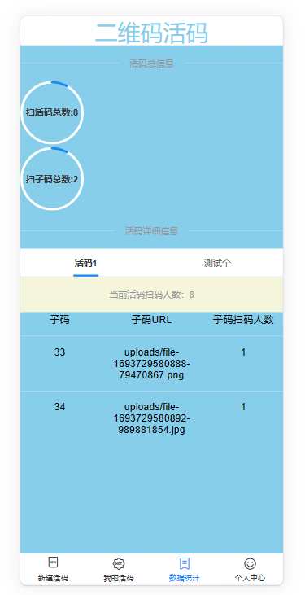
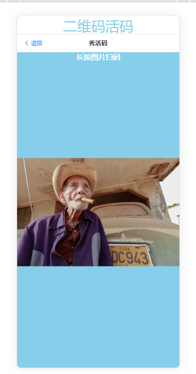

# 二维码活码全栈项目开发分析

## 导言

> 活码是一个或多个二维码聚合而成的一个固定的二维码。
>
> 活码常常用于用户线下推广等用途等。活码内容支持修改，编辑，极大的方便用户使用。
>
> 于是决定自己手写一个建议的活码工具

## 原理

> 活码的原理就是通过扫描一个固定的二维码（通常是一个跳转链接），然后跳转到另一真实的二维码页面，这个页面中的二维码可以随时在后台切换。

## 项目介绍

- 前端技术
  - **ts+vue3+vue-router+vite+axios+qrcode(实现二维码)+vant(前端移动端组件库）**
- 后端技术
  - **express+cors(处理跨域)+multer（上传图片）+mysql（连接数据库）**
- 数据
  - **mysql**
- 服务器
  - **阿里云+宝塔**

### 新建活码页面

- 添加活码标题
- 活码描述
- 添加子码
- 设置切换阈值
- 长传logo图片

### 我的活码页面

- 显示所有已经添加的活码
- 右滑删除添加的活码
- 左滑预览活码（非后台用户进入，进行数据统计）

### 数据统计

- 统计活码总数
- 统计子码总数
- 统计单个活码信息详情
- 统计单个活码子码信息详情

### 个人中心页面

- 待开发哈哈哈

### 子码页面

- 长按图片扫码（非后台人员进行数据统计）

### 代码分析

视频地址：https://www.bilibili.com/video/BV17z4y1T7fA/

## 总结

> 有点意思